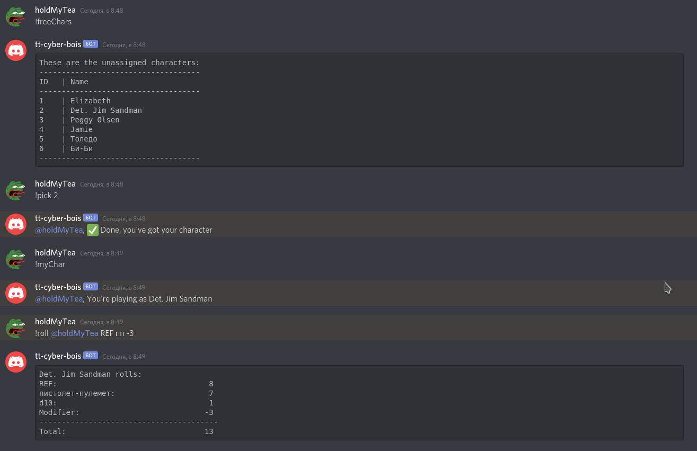
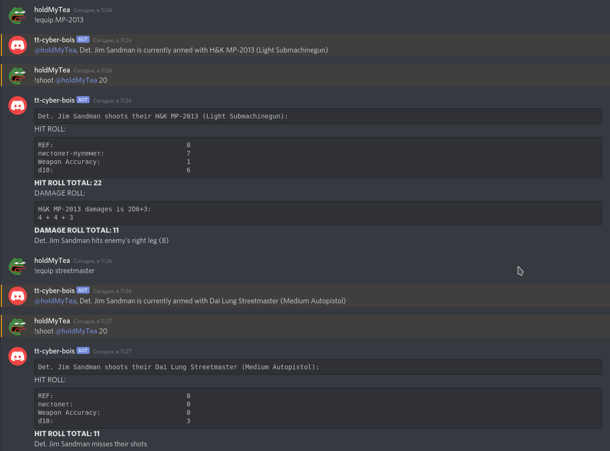

# CуberPunk Tаblеtоp Discord Bot
A simple bot for Discord, it's main feature - auto skill rolls with a single command.
It also has some other stuff around just to get skill rolls easier.

### Command list
* **!freeChars** - prints the list of unassigned characters from db, with their IDs
* **!pick** *charId* - assignes characeter with *charId* to Discord user who entered this command
* **!myChar** - prints the name of current character assigned to the user
* **!roll** *userTag attribute shortSkillName [modifier]* - looks up the character's stats of *attribute* and *skill* (indentified by *shortSkillName*) for the user tagged in *userTag*, sums them up, add a *d10* toll to them and applies modified if necessary. For exmaple: `!roll @holdMyTea REF пп -3`
* **!skills** *[attribute]* - prints the list of attributes and their short names. If *attribute* is supplied, prints only the skills tied to this attribute
* **!skill** *query* - looks up skill list in db, and prints the list of them that are similar to *query*

* **!equip** *[query]* - Equips the weapon matching the *query*. If called without param, prints the name of the currently equipped weapon.
* **!shoot** *userTag hitRequirement* - looks up character stats and their weapon and permorms the hit roll, if it's more or equal to *hitRequirement* rolls damage and hit area. `!shoot @holdMyTea 20`

* **!map** - prints a link for a hosted pic of the Night City map
* **!help** - prints the list of all commands with short instructions
* **!up** - bot's greeting :blush:

### How to run it
1. Clone it
2. Create a `discord.env` file in the root folder, and add `BOT_SECRET_TOKEN=` to it followed by your bot secret token
3. You would likely want your own characters in db, you can add them in `db/scripts/2 - charsLoad.sql` file
4. `docker-compose up`
5. Given you've already added the bot to a channel, you should be able to enter commands and get responses, try it with **!up**
6. If all went well (I hope it did), you should get your players pick characers from db by means of **!freeChars** and **!pick** and you can get **!roll**ing
