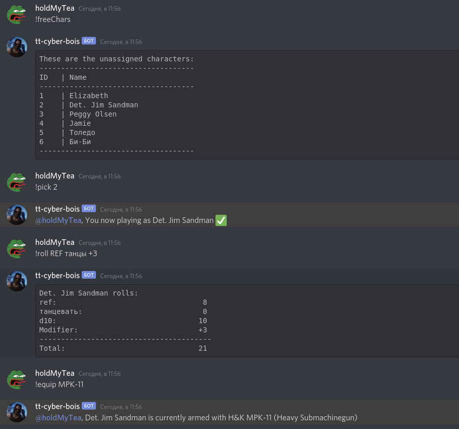
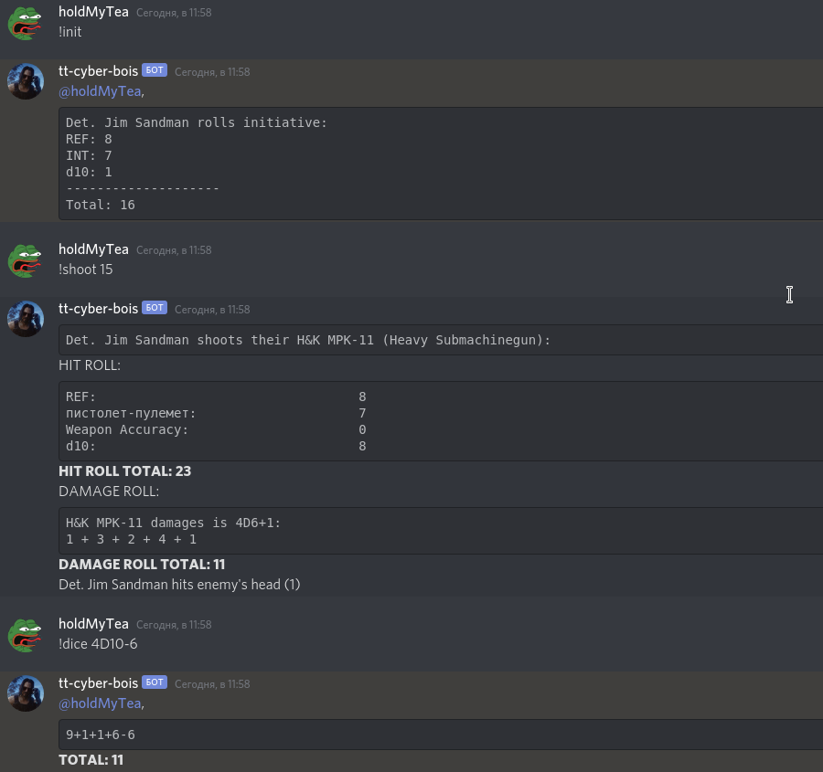

# CyberPunk 2020 Tabletop Discord Bot
A simple bot for Discord, it's main feature - stats-based skill rolls with a single command.
It also has some other stuff just to simplify the game process.

### Command list
#### Character assignment
* **!freeChars** - prints the list of unassigned characters from db, with their IDs
* **!pick** *charId* - assignes character with *charId* to Discord user who entered this command
* **!myChar** - prints the name of the assigned character
#### Stat-based commands (character must be picked first)
* **!roll** *attribute skillQuery [modifier]* - looks up the character's stats of *attribute* and *skill* (indentified by *skillQuery*) for the character picked by message author, sums them up, adds a *d10* roll and applies modifier if necessary. For exmaple: `!roll REF танцы -3`
* **!equip** *[query]* - Equips the weapon matching the *query*. If called without param, prints the name weapon currently equipped by character. For example: `!equip MPK-11` _Disclaimer:_ I didn't transfer all the weapons, only firearms and melee weapons. No Wunderwaffe, throwing and old weapons.
* **!shoot** *hitRequirement* - looks up character and equipped weapon stats and performs the hit roll, if it's more or equal to *hitRequirement* rolls damage and hit area. `!shoot 20`
* **!strike** *hitRequirement* - same as **!shoot** (so you don't need to _shoot_ a sword).
* **!init** *[total]* - rolls character's initiative for combat (REF + INT + d10). If called with `total` param prints the most recent `!init` rolls of all characters.
#### Other commands
* **!dice** *diceString* - parses the *diceString* and rolls dices, for example: `!dice 4d6+3`, `!dice D10`, `!dice d3-1`.
* **!map** - prints a link for a hosted pic of the Night City map
* **!help** - prints this command reference
* **!skills** *[attribute]* - prints the list of attributes and their short names. If *attribute* is supplied, prints only the skills tied to this attribute
* **!skill** *query* - prints the list of skills similar to *query*
* **!up** - bot's greeting :blush:

### Did you play with it?
Yes, I've got a couple of sessions with it and it was rather nice. After this "beta-testing" I've made some [adjustments](https://github.com/holdMyTea/cyberpunk-tabletop-bot/pull/2) to make it more user-friendly and add some functionality.

### How to run it
1. Clone it
2. Create a `discord.env` file in the root folder, and add `BOT_SECRET_TOKEN=` to it followed by your bot secret token
3. You would likely want your own characters in db, you can add them in `db/scripts/2 - charsLoad.sql` file
4. `docker-compose up`
5. Given you've already added the bot to a channel, you should be able to enter commands and get responses, try it with **!up**
6. If all went well (I hope it did), you should get your players pick characers from db by means of **!freeChars** and **!pick** and you can get **!roll**ing
